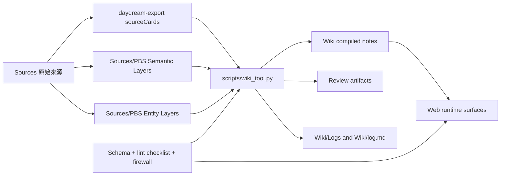
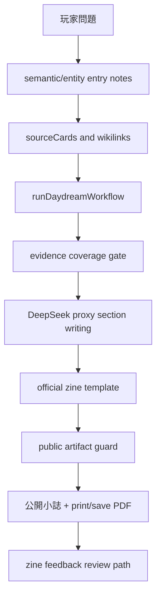
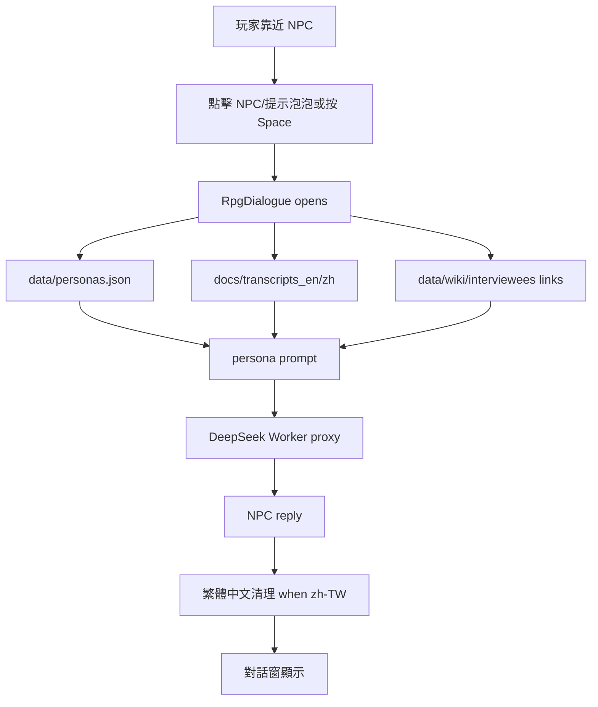

# PBS Runtime Architecture

## 簡文描述

PBS 現在分成三層：`Sources` 保存原始資料，`Wiki` 整理可重用的知識筆記，`Schema / Review / Logs` 管理規則、檢查與人工審核。網站 runtime 目前會讀取部分 vault 內容與 web assets，但不會直接改寫 raw sources。

小誌生成流程是從玩家問題開始，先讀 PBS semantic/entity entry notes 與 sourceCards，再交給 zine workflow 組成四段式文章、證據門檻、公開語言清理、模板渲染、列印/存 PDF。新的 Wiki tooling 已經能產生 source-bounded draft notes，但尚未完全接入小誌 runtime 的 RAG context。

NPC 對話流程是玩家在地圖中靠近 NPC 後，必須點擊 NPC/提示泡泡或按 Space 才會打開對話。對話會使用 persona、transcript、wiki links、retrieved evidence 與 DeepSeek proxy。繁體中文輸出會經過語言指令與常見簡轉繁清理。

## Obsidian Vault 架構

## 小誌生成流程

## NPC 對話流程

## 目前邊界

- Wiki tooling 已經部署到 repo，但小誌 runtime 還沒有完整優先讀取 compiled Wiki notes。
- Obsidian app/plugin 層目前使用原生 Canvas/Graph；Dataview、Excalibrain、local vector DB 都先延後。
- Runtime 私人對話不自動寫入 `obsidian-vault/Sources/`。
