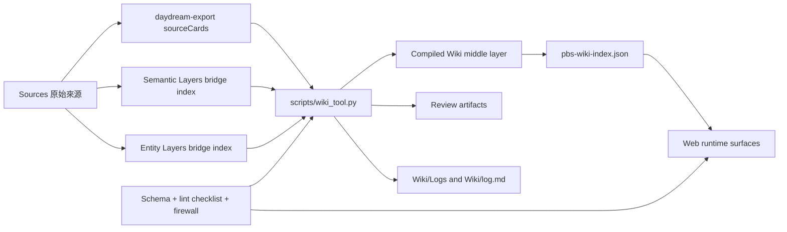
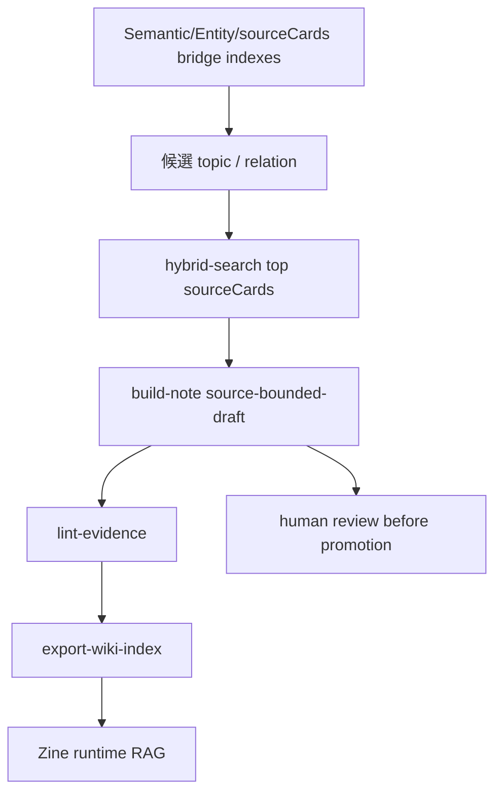
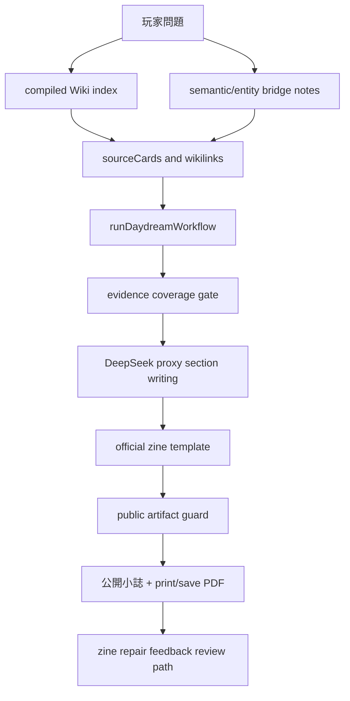
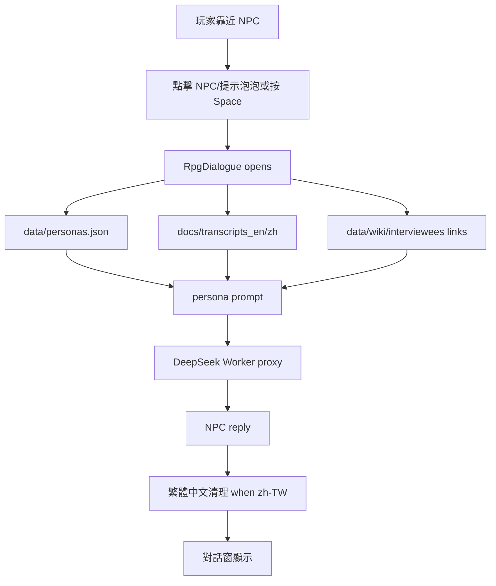

# PBS Runtime Architecture

## 簡文描述

PBS 現在分成四層：`Sources` 保存原始資料，`Sources/PBS Semantic Layers` 與 Entity Layers 作為 source-derived bridge index，`Wiki/Concepts` 到 `Wiki/Syntheses` 是 compiled LLM Wiki 中間層，`Schema / Review / Logs / webview-ui` 管理規則、檢查、人工審核與 runtime 輸出。

小誌生成流程是從玩家問題開始，先讀 compiled Wiki index、PBS semantic/entity bridge notes 與 sourceCards，再交給 zine workflow 組成四段式文章、證據門檻、公開語言清理、模板渲染、列印/存 PDF、repair feedback。Wiki tooling 現在能產生 source-bounded draft notes，並匯出 `webview-ui/public/assets/pbs-wiki-index.json` 給 runtime RAG 使用。

NPC 對話流程是玩家在地圖中靠近 NPC 後，必須點擊 NPC/提示泡泡或按 Space 才會打開對話。對話會使用 persona、transcript、wiki links、retrieved evidence 與 DeepSeek proxy。繁體中文輸出會經過語言指令與常見簡轉繁清理。

## Obsidian Vault 架構

## 中間層增厚流程

## 小誌生成流程

## NPC 對話流程

## 目前邊界

- Wiki tooling 已經部署到 repo；小誌 runtime 會讀取匯出的 compiled Wiki notes，但每篇 note 仍需 sourceRefs 與 lint 狀態保護。
- Obsidian app/plugin 層目前使用原生 Canvas/Graph；Dataview、Excalibrain、local vector DB 都先延後。
- Runtime 私人對話不自動寫入 `obsidian-vault/Sources/`。
- `Sources/PBS Semantic Layers` 保留為 bridge index，不是 final synthesis。
