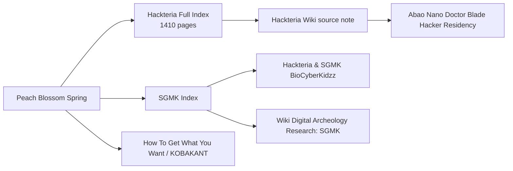

# PBS Wiki Visual Dashboard

This is the Markdown fallback for the visual map. If `PBS Wiki Visual Map.canvas` does not open, use this page first.

## Core map



## Open these first

- [[Home]]
- [[Peach Blossom Spring]]
- [[Sources/Hackteria Full Index]]
- [[Sources/Hackteria Wiki]]
- [[Sources/SGMK Index]]
- [[Sources/How To Get What You Want - KOBAKANT DIY]]

## What was imported

- Hackteria Wiki public main namespace: **1410 pages**
- Failures: **0**
- Images/files: not mirrored yet
- Category/template/talk/user namespaces: not mirrored yet

## Canvas version

- [[PBS Wiki Visual Map.canvas]]

`.canvas` is Obsidian Canvas JSON. It is not a normal Markdown note; it opens in Obsidian's Canvas view only after the containing folder is opened as a vault.

## Relationship layer added

- [[Sources/Hackteria Relationship Index]]
- Internal MediaWiki page links added: **2528**
- Category memberships added: **351**
- Category cluster notes created: **31**

### How to see meaningful structure in Graph View

The first graph looked round because `Hackteria Full Index` links to every page, creating one giant hub-and-spoke star.

For better structure, use Graph filters:

```text
-path:"Sources/Hackteria Full Index"
```

Then optionally focus on relationship layer:

```text
path:"Sources/Hackteria Full" OR path:"Sources/Source Categories/Hackteria"
```

Turn on Groups:

- `path:"Sources/Source Categories"` → unified source-native category hubs
- `line:("DIY") OR line:("bio") OR line:("microscopy")` → content clusters

Obsidian Graph does not store explicit edge weights. Stronger structure emerges from more real wikilinks, categories, and shared cluster notes.

## How to view How To Get What You Want

Open:

- [[Sources/How To Get What You Want Dashboard]]
- [[Sources/How To Get What You Want - KOBAKANT DIY]]

Graph filter for HTGWYW only:

```text
path:"Sources/How To Get What You Want"
```

Hackteria dominates the graph because it has 1410 pages. HTGWYW currently has 15 seed notes. For a balanced corpus, crawl the full KOBAKANT / HTGWYW archive next.

## Graph cleanup note

Open [[GRAPH_VIEW_GUIDE]] for why the graph made concentric circles and what filter/settings are now applied.

Canonical full folders:

- `Sources/Hackteria Full/`
- `Sources/How To Get What You Want Full/`
- `Sources/SGMK Full/`

Old seed folders were removed after full crawls were verified:

- `Sources/Hackteria/`
- `Sources/How To Get What You Want/`

Canonical source folders now use the `Full` suffix.

## PBS semantic structure

The corpus is now organized into three PBS Daydream semantic layers:

- [[Sources/PBS Semantic Layers/Tools|Tools]]
- [[Sources/PBS Semantic Layers/Concepts|Concepts]]
- [[Sources/PBS Semantic Layers/Events|Events]]

Source colors use the PBS palette:

- Hackteria = yellow `#FCF46B`
- How To Get What You Want / KOBAKANT = blue-green `#69C3AA`
- SGMK = pink `#FFD4FF`

See:

- [[Sources/PBS Semantic Layers/README]]
- [[Sources/PBS Semantic Layers/SOURCE_COLORS]]

Graph view now includes `Sources/PBS Semantic Layers` and colors source folders separately from semantic layer notes.

## PBS entity structure

Entity axes have now been added as cross-cutting coordinates:

- [[Sources/PBS Entity Layers/People|People]]
- [[Sources/PBS Entity Layers/Places|Places]]
- [[Sources/PBS Entity Layers/Time|Time]]

These are not inside Tools/Concepts/Events. They intersect source cards across all three semantic layers.

See:

- [[Sources/PBS Entity Layers/README]]

Daydream export now includes `entities.people`, `entities.places`, and `entities.times` per sourceCard, plus graph relations `mentions_entity` and `has_entity`.

## Source-native categories

Native categories are now normalized here:

- [[Sources/Source Categories/README]]
- Hackteria MediaWiki categories remain under `Sources/Source Categories/Hackteria/`
- SGMK categories are under `Sources/Source Categories/SGMK/`
- HTGWYW WordPress categories are under `Sources/Source Categories/HTGWYW/`

These are different from PBS semantic layers (`Tools / Concepts / Events`).
